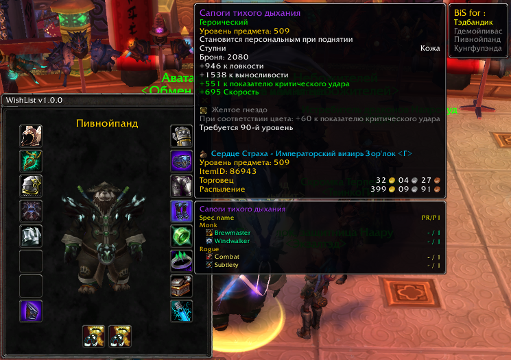
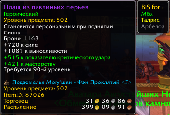

# World of Warcraft Addon: WishList

This is a minimal World of Warcraft addon to help you with your Best in Slot WishList.

## Installation
1. Copy the `WishList` folder into your WoW `_classic_/Interface/AddOns/` directory.
2. Launch or reload World of Warcraft.
3. Enable the addon in the AddOns menu.

## Screenshots
1. Addon Window 

2. Item tooltip


## wishlistdata schema

The `Items` table in `wishlistdata.lua` is structured as follows:

```lua
Items = {
    ["slot"] = {
        [itemId] = {
            players = {
                {"PlayerName1", true},   -- true if player wants the item, false otherwise
                {"PlayerName2", false},
                -- ... more players
            },
        },
        -- ... more itemIds
    },
    -- ... more slots (e.g. "head", "chest", "legs", etc.)
}
```

